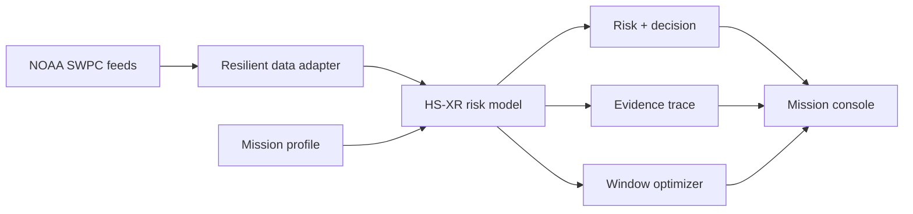

# HelioShield AI

[](https://github.com/deshrajvermay9517-png/helioshield-ai/actions/workflows/ci.yml)

> Explainable AI that turns space-weather signals into safer, evidence-backed launch decisions.

HelioShield AI is a working proof of concept for the **August 2026 AI Builders Challenge with IBM Bob** under the **Advance Space Exploration with AI** theme.

**Live demo:** https://helioshield-ai.universboss9517.chatgpt.site

**GitHub repository:** https://github.com/deshrajvermay9517-png/helioshield-ai

It ingests public NOAA Space Weather Prediction Center signals, combines them with mission sensitivity, estimates launch risk with a transparent probabilistic model, explains the strongest risk drivers, and recommends a safer launch window. If NOAA is temporarily unavailable, the app switches to a clearly labelled demo-safe dataset so every judge can complete the product flow.

## Problem statement

Mission teams receive large volumes of specialized space-weather telemetry, but the operational question is simple and time-critical: **is this mission profile safe to launch now, and why?** Raw Kp, solar-proton, and X-ray measurements are difficult to interpret together, affect missions differently, and can create either hidden risk or unnecessary delays.

## Solution

HelioShield transforms those signals into a human-reviewable mission decision:

- **Mission-aware risk scoring** for satellite, lunar cargo, and crewed LEO profiles.
- **Explainable recommendations** with feature-level evidence and thresholds.
- **24-hour window comparison** to identify the lowest-risk launch opportunity.
- **Counterfactual scenario lab** for testing changing Kp, proton, and X-ray conditions.
- **Human-in-the-loop boundary** that keeps final authority with mission control.
- **Resilient demonstration mode** when live data cannot be reached.

## AI approach and architecture

The HS-XR v0.3 prototype is a transparent logistic classifier calibrated to published NOAA alert thresholds. It normalizes three signal families, applies mission-profile sensitivity, and outputs a risk probability and one of three decisions: `GO`, `CONDITIONAL`, or `HOLD`.

The explanation layer ranks feature contributions and generates an evidence-grounded mission brief. The forecast evaluator runs the same model across NOAA Kp forecast windows to produce a counterfactual recommendation.



The model is intentionally inspectable and is **not flight-certified**. Operational use would require historical back-testing, calibration with mission outcomes, agency review, and redundant data sources.

## Selected challenge theme

**August Challenge — Advance Space Exploration with AI**

The project fits the theme by converting data-heavy space-weather feeds into actionable mission insight, improving safety and reliability while making complex space data understandable to both technical and non-technical stakeholders.

## How IBM Bob was used

> **Submission owner action required:** Complete the material IBM Bob development pass in [`docs/IBM-BOB-HANDOFF.md`](docs/IBM-BOB-HANDOFF.md), then replace this note with the actual prompts, changes, tests, and evidence from that session. Do not claim Bob work that was not performed.

The repository includes a scoped IBM Bob workflow covering architecture review, data-adapter hardening, model tests, responsible-AI documentation, and final build verification. This creates an auditable record of Bob's contribution instead of a generic usage statement.

## Product flow

1. Choose a mission profile.
2. Refresh NOAA observations or continue in labelled demo-safe mode.
3. Inspect the risk probability, decision, and evidence trace.
4. Select forecast windows to compare risk.
5. Open **Scenario lab** and stress-test the launch envelope.

## Data sources

- [NOAA Planetary K-index](https://www.swpc.noaa.gov/products/planetary-k-index)
- [NOAA GOES Proton Flux](https://www.swpc.noaa.gov/products/goes-proton-flux)
- [NOAA GOES X-ray Flux](https://www.swpc.noaa.gov/products/goes-x-ray-flux)
- [NOAA SWPC Data Access](https://www.swpc.noaa.gov/content/data-access)

## Technology

- Next.js-compatible Vinext + React + TypeScript
- Cloudflare Worker server runtime
- NOAA SWPC JSON data feeds
- Transparent logistic risk model and counterfactual window optimizer
- Shadcn/Radix accessible controls
- IBM Bob for the required development, review, testing, and documentation pass

## Full-stack scope

HelioShield is a **frontend-heavy full-stack prototype**, not a frontend-only mockup.

- **Frontend:** the React mission console, explainable score cards, forecast-window selector, and Scenario Lab in `app/page.tsx`.
- **Backend:** the server-side `/api/space-weather` route fetches and normalizes NOAA feeds, keeps upstream calls away from the browser, and returns a safe labelled fallback when a feed is unavailable.
- **Shared intelligence:** `lib/risk-engine.ts` computes the mission-aware probability, decision, evidence contributions, and safer window.
- **Persistence:** no database, account system, or stored personal data is needed for this proof of concept.
- **Hosting:** the production build runs on a Cloudflare Worker-compatible runtime through ChatGPT Sites.

## Local setup

```bash
npm install
npm run dev
```

Production verification:

```bash
npm run build
npm test
```

No API key is required. The server route fetches public NOAA data and automatically returns labelled demo-safe values if the source is unavailable.

## Repository map

```text
app/page.tsx                     Mission console and interactions
app/api/space-weather/route.ts  NOAA adapter with safe fallback
lib/risk-engine.ts              Explainable probability model
docs/ARCHITECTURE.md            Technical design and decisions
docs/MODEL-CARD.md              Model behavior, thresholds, limits
docs/IBM-BOB-HANDOFF.md         Required authentic Bob workflow
docs/DEMO-SCRIPT.md             Timed public-video script
docs/SUBMISSION.md              Copy-ready challenge submission
docs/SUBMISSION-CHECKLIST.md    Exact remaining owner actions
```

## Responsible AI

- Inputs and thresholds are visible.
- Demo data is explicitly labelled.
- Every decision includes evidence.
- The UI states that the tool is decision support, not certification.
- Mission control retains final authority.

## Team

**Deshraj Verma** — Student developer, B.Tech CSE, IILM University

## License

MIT — see [`LICENSE`](LICENSE).
